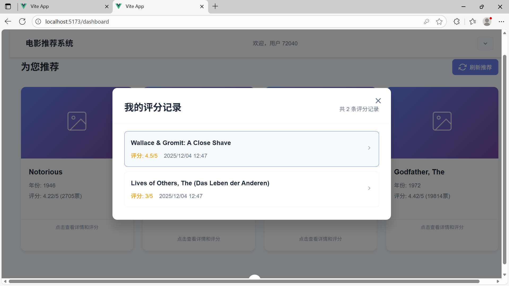
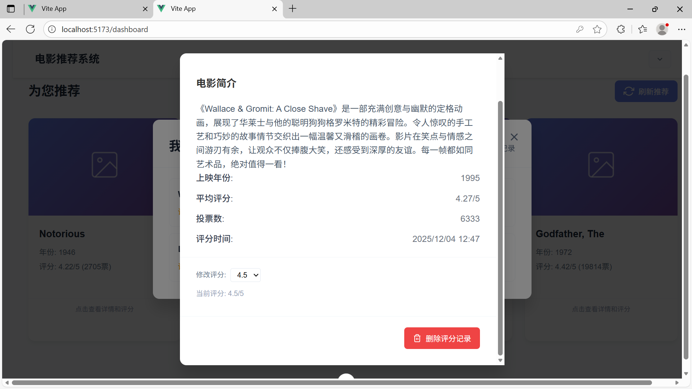

# 个性化电影推荐系统 - 项目文档与结题报告

## 第一部分：项目文档

### 1. 需求分析

#### 1.1 项目背景与目标
- **背景**： 随着信息过载时代的到来，用户难以从海量电影中发现个人兴趣所在。个性化推荐系统能有效解决这一问题，提升用户体验。
- **目标**： 设计并实现一个基于协同过滤算法或深度学习的电影推荐系统，能够为用户提供个性化的电影推荐列表。核心目标是使用推荐算法并集成一种LLM进行内容生成，提供一个可交互的演示系统。

#### 1.2 功能性需求
- **用户功能**：
    1. **用户注册/登录**： 用户可创建账户并登录系统。
    3. **评分/行为记录**： 用户可以对电影进行评分（如1-5星）。
    4. **获取推荐**： 用户登录后，系统在首页或推荐页为其展示个性化电影列表。
    5. **电影详情查看**： 点击电影可查看详细信息（标题、类型、简介、平均分等）。
- **系统功能**：
    1. **数据管理**： 系统能存储和管理用户、电影、评分数据。
    3. **推荐生成**： 系统能根据训练好的模型，为指定用户实时生成推荐结果。

#### 1.3 非功能性需求
- **性能**： 推荐结果生成响应时间应在可接受范围内。
- **可扩展性**： 系统设计应便于未来接入更多数据源、尝试更复杂的模型。
- **易用性**： 用户界面应简洁直观，易于操作。

### 2. 概要设计

#### 2.1 系统架构图
我们采用典型的三层架构：
```
表示层 (Web UI) <---> 业务逻辑层 (推荐引擎) <---> 数据层 (数据库/文件)
```
- **表示层**： 用户交互的网页界面，使用Vite+Vue3+TypeScript，搭配Flask框架。
- **业务逻辑层**： 核心推荐算法所在，处理用户请求，调用模型生成推荐结果。
- **数据层**： 存储数据，可使用MySQL存储结构化数据(由于大模型生成占主要的时间消耗，所以我们选择不使用redis做缓存)。

#### 2.2 核心模块划分
1. **用户交互模块**： 处理用户注册、登录、评分等请求。前端主要界面在`Frontend\SElab\src\views`文件夹中。后端由`database\back_end.py`负责，`database\models.py`文件辅助
2. **数据预处理模块**： 负责清洗、转换原始数据（如电影信息、评分数据）。`databasepart\data_download&import.py`文件负责
3. **数据库模块**：负责建立对应的数据库。`databasepart\table_build.sql`负责
4. **后端测试模块**：对后端进行独立的功能测试。`databasepart/test.py`负责
5. **前端测试模块**：对前端进行独立的功能测试。使用MSW拦截http请求进行测试，主要实现在`Frontend\SElab\src\mocks`文件夹中
6. **推荐算法模块**： 实现了基于物品的协同过滤召回，以及基于热门物品的召回，在`databasepart\compute_item_sim.py`和`databasepart\recommend.py`。

#### 2.3 技术选型
- **后端语言**： Python
- **Web框架**： Flask
- **核心算法库**： Scikit-learn
- **数据处理库**： Pandas
- **数据库**： MySQL
- **前端**： Vite+Vue3+TypeScript框架。

### 3. 详细设计

#### 3.1 基础数据库设计
- **用户表 (user)**： `user_id (主键)`, `user_name`, `password`
- **电影表 (movie)**： `movie_id (主键)`, `movie_name`, , `release_year`
- **评分表 (user_judge)**： `user_id (主键，外键)`, `movie_id (主键，外键)`, `rating`（评分，如 4.5）, `timestamp`
- **类别表(genre_table)**: `genre_id(主键)`，`genre_name`
- **电影类别表**：`movie_id(主键，外键)`，`genre_id(主键，外键)`
- **用户评论表**：`user_id(主键，外键)`，`movie_id(主键，外键)`，`comment`

#### 3.2 推荐系统模块详细设计

##### 3.2.1 推荐系统相关数据库设计

1. item_similarities表，用于记录电影间相似度：
   
```sql
item_similarities (
    movie_id INT NOT NULL, -- 电影ID
    similar_movie_id INT NOT NULL, -- 相似电影ID
    similarity DECIMAL(5,4) NOT NULL, -- 相似度
    FOREIGN KEY (movie_id) REFERENCES movie(movie_id) ON DELETE CASCADE,
    FOREIGN KEY (similar_movie_id) REFERENCES movie(movie_id) ON DELETE CASCADE,
    PRIMARY KEY (movie_id, similar_movie_id),
    INDEX idx_movie_id (movie_id),
    INDEX idx_similarity (similarity DESC)
);
```

2. movie_stats表，用于记录电影的平均评分和评分次数：

```sql
movie_stats (
    movie_id INT PRIMARY KEY, -- 电影ID
    avg_rating DECIMAL(3,2) NOT NULL, -- 平均评分
    vote_count INT NOT NULL, -- 评分次数
    updated_at DATETIME DEFAULT CURRENT_TIMESTAMP ON UPDATE CURRENT_TIMESTAMP, -- 更新时间
    FOREIGN KEY (movie_id) REFERENCES movie(movie_id) ON DELETE CASCADE,
    INDEX idx_vote_avg (vote_count, avg_rating)
);
```

3. user_favorite_genres表，用于记录用户的喜好类型：

```sql
user_favorite_genres (
    user_id INT NOT NULL, -- 用户ID
    genre_id SMALLINT NOT NULL, -- 类别ID
    preference_score DECIMAL(3,2) DEFAULT 1.0, -- 偏好分数（可添加时之间设为1）
    FOREIGN KEY (user_id) REFERENCES user(user_id) ON DELETE CASCADE,
    FOREIGN KEY (genre_id) REFERENCES genre_table(genre_id) ON DELETE CASCADE,
    PRIMARY KEY (user_id, genre_id),
    INDEX idx_user_genre (user_id, genre_id)
);
```

##### 3.2.2 推荐系统核心算法设计

1. **物品相似度计算**

   在 `compute_item_sim.py` 文件中实现了基于物品的协同过滤(Item-Based Collaborative Filtering, ItemCF)的核心算法： 

   1. **数据准备阶段**：  
      - 从数据库中读取用户-电影评分数据   
      - 构建稀疏评分矩阵 R (用户×电影)   
      - 将矩阵转置为物品-用户矩阵 R.T (电影×用户) 
   2. **相似度计算**：   
      - 使用余弦相似度计算电影之间的相似性   
      - 对每部电影，找出与其最相似的 Top-K 部电影   
      - 过滤掉低于最小相似度阈值的电影对 
   3. **存储优化**：
      - 采用分批处理防止内存溢出
      - 将计算结果保存到数据库的 `item_similarities` 表中 

2. **推荐生成算法**

   在`recommend.py`文件中实现了完整的推荐生成流程：

   1. **用户画像构建**：
      - 查询用户历史评分记录
      - 若用户无评分记录，则启用冷启动机制
   2. **候选电影生成**：
      - 基于用户已评分电影，查找相似电影
      - 累计相似度得分，生成候选推荐列表
   3. **混合推荐策略**： 
      - 60% ItemCF个性化推荐   
      - 30% 基于用户偏好的热门电影  
      - 10% 通用热门电影
   4. **冷启动处理**：对于新用户或无评分记录的用户，系统采用以下冷启动策略：
      - 基于用户偏好的类型推荐     
      - 通用热门电影兜底

3. **推荐多样性与随机性增强**

   为了提高推荐结果的多样性和避免单调性，算法引入了多种随机性机制： 

   1. **加权随机选择**：   
      - 根据电影评分和投票数计算权重
      - 使用加权随机算法选择最终推荐结果 
   2. **混合推荐策略**：
      - 结合个性化推荐和热门推荐
      - 通过不同比例混合确保推荐多样性

算法优势如下：

1. 性能优化：
   - **大数据处理能力**：
     - 采用稀疏矩阵存储评分数据
     - 分批处理避免内存溢出
     - 分块计算相似度提高效
   - **数据库优化**：
     - 使用预计算的相似度表
     - 批量插入减少数据库访问次数
     - 索引优化提高查询速度

2. 推荐质量保障：
   - **冷启动解决方案**：
     - 多层次的冷启动策略
     - 基于用户偏好的个性化推荐
     - 热门内容兜底保证推荐覆盖率 
   - **推荐多样性**：
     - 混合推荐策略平衡个性化与多样性
     - 随机性增强避免推荐结果过于集中
     - 多种类型内容组合呈现

3. 算法可扩展性：
   - **模块化设计**：
     - 相似度计算与推荐生成分离
     - 易于替换不同的相似度算法
     - 支持增量更新机制
   - **灵活配置**：
     - 可调节的相似度阈值
     - 可配置的推荐比例
     - 支持不同的随机化程度

#### 3.3 接口设计
- `GET /api/health`：检查服务器的状态
- `POST /api/login`：用户登录。数据格式： `{"user_id": "用户账号" number类型, "password": "密码" string类型}`
- `POST /api/register`：用户注册。数据格式`{"user_name": "用户账号" string类型, "password": "密码" string类型}`
- `POST /api/judge`：用户评分。数据格式`{"user_id": "用户账号" number类型， "movie_id": "电影id" number类型， "rating": "用户评分" number类型}`
- `POST /api/recommend`：推荐电影。数据格式`{"user_id": "用户账号" number类型, "record_times": "先前已经推荐过的次数(第一次为0)" number类型}`
- `POST /api/like_query`：喜好查询。数据格式`{"user_id": "用户账号" number类型}`
- `POST /api/like`：添加喜好。数据格式`{"user_id": "用户账号" number类型, "like": "用户喜好" 数组类型，其中应当是电影类别名称的数组}`
- `POST /api/change_password`：修改密码。数据格式`{"user_id": "用户账号" number类型, "new_password": "新密码" string类型}`
- `POST /api/get_record`：获取评分记录。数据格式`{"user_id": "用户账号" number类型}`
- `POST /api/get_movie`：获取电影的详细信息。数据格式`{"movie_id": "电影id" number类型}`
- `POST /api/delete_judge`：删除评分。数据格式`{"movie_id": "电影id" number类型 "user_id": "用户id" number类型}`

#### 3.4 LLM接口设计
- `LLMClient()`:调用LLM api的类
- `generate_movie_review_prompt`:生成短评的prompt
- `generate_movie_summary_prompt`:生成摘要的prompt
- `generate_movie_review_interface`:提供给后端的接口

### 4. 测试报告

#### 4.1 数据集介绍
- 使用公开数据集，**MovieLens**。
- 数据集包含了1w部电影，7w名用户的1000w条评分和10w条短评。

#### 4.2 系统功能测试
- 对于后端的测试我们使用pytest运行`databasepart/test.py`文件即可，对于整体的测试可以看第二部分的项目运行截图。
- 前端可以通过修改`Frontend\SElab\.env.development`中的环境变量进行脱离后端、拦截api请求独立测试，详见`Docs\frontend\deploy.md`

---

## 第二部分：项目结题报告

### 1. 项目运行截图

#### 1.1 用户界面
> 
> *图1：系统登录界面，用户输入账号密码即可登录*
>
> 
>
> *图2：系统注册界面，输入对应信息即可登录*
>
> 
>
> *图3：修改密码界面，用户在此处修改密码*

#### 1.2 电影主页/浏览界面

> 
>
> *图4：用户的电影偏好选择*
>
> 
> *图5：首页根据用户选择的喜好类别对电影进行个性化推荐*

#### 1.3 电影详情与评分界面
> 
> *图6：用户可在电影详情页进行评分操作*
>
> 
>
> *图7：用户可以查询自己的评分记录*
>
> 
>
> *图8：进入后可以对评分进行修改和删除*


### 2. 非功能需求解决方案（提高项）

#### 2.1 性能优化方案
- **问题**： 协同过滤算法实时计算慢，尤其用户量大时。
- **方案**：
    1. **离线计算，在线查询**： 定时（如每天凌晨）为所有用户预计算好推荐结果，存入数据库。用户访问时直接查询，响应极快。

#### 2.2 冷启动问题解决方案
- **问题**： 新用户无行为数据，无法进行个性化推荐。
- **方案**：
    1. **热门推荐**： 为新用户推荐当前最热门的电影。
    2. **基于内容的推荐**： 在注册时让用户选择感兴趣的电影类型，基于类型进行推荐。
    3. **利用深度学习模型**： 设计模型时可以考虑融入电影内容特征（类型、演员、导演），对缓解物品冷启动有帮助。

#### 2.3 可扩展性设计
- **模块化设计**： 后端和前端实现了相当程度的解耦。确保了代码的模块化，即使更换前端也能很快的使用现有的后端进行适配。

### 3. 项目总结与展望

- **工作总结**： 我们实现了一个可以冷启动也可以根据用户的偏好，对看过电影的评分等因素给用户个个性化推荐电影的电影推荐系统。实现了用户密码管理，评分记录管理等功能。
- **遇到的挑战与解决方案**： 如数据稀疏性、算法调参等。
- **未来展望**： 现在在后端方面其实已经实现了用户自评价的模块，在未来，也许我们能够实现类似豆瓣的用户集体评论并进行讨论的功能。

### 4. 组员分工情况

| 学号 | 姓名 | 主要分工 | 贡献说明 |
| :--- | :--- | :--- | :--- |
| PB22111663 | 崔玉皓 | **后端开发，初始数据的处理，综合测试** | 完全负责后端开发，数据集的预处理，数据库的处理。同时还负责了后端测试，项目整体测试。总代码量接近1.8k行。 |
| PB22111659 | 龙奕均 | **操作系统算法核心开发** | 完全负责推荐系统核心算法的开发与实现，包括基于物品的协同过滤系统的设计与搭建，基于热门物品及用户喜好物品的召回，以及用户冷启动的设计。 |
| PB22111673 | 符群儒 | **前端开发与测试** | 完全负责前端开发，同时还参与了项目整体测试。|
| PB22111689 | 宋烨和 | **LLM接口设计** | 设计LLM相关接口 |
