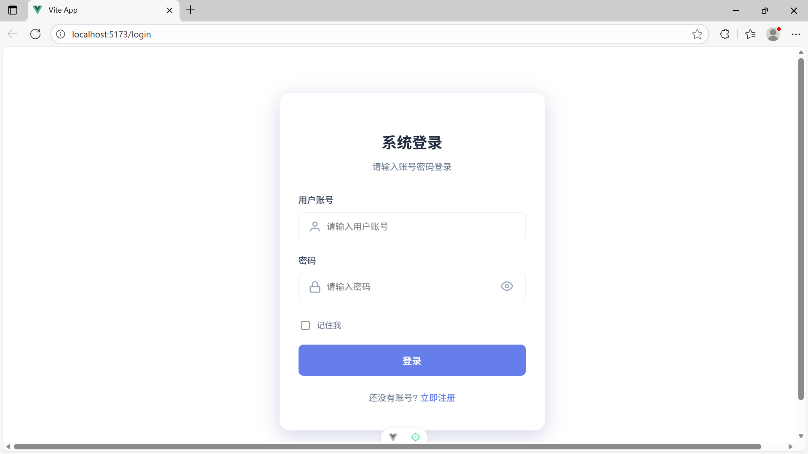
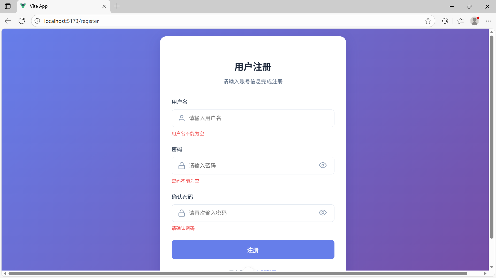
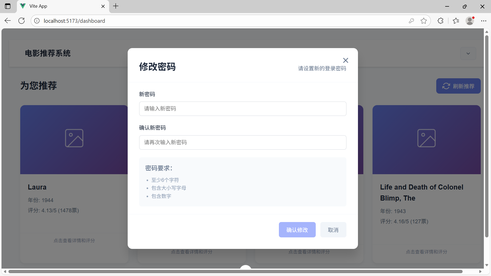
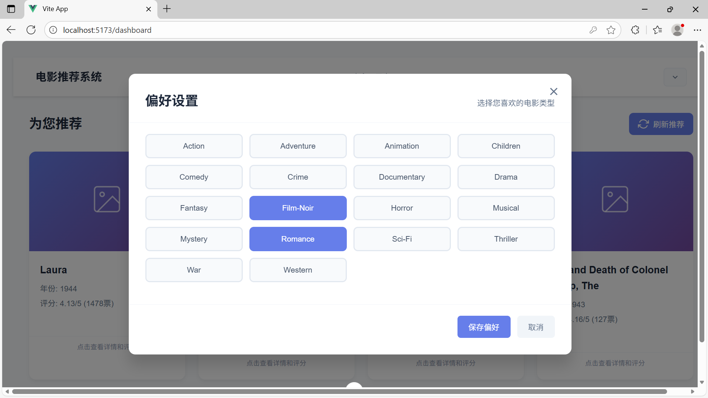
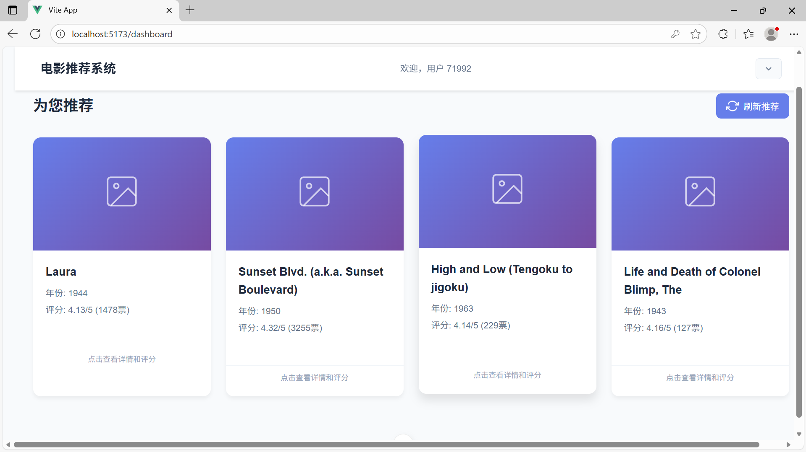
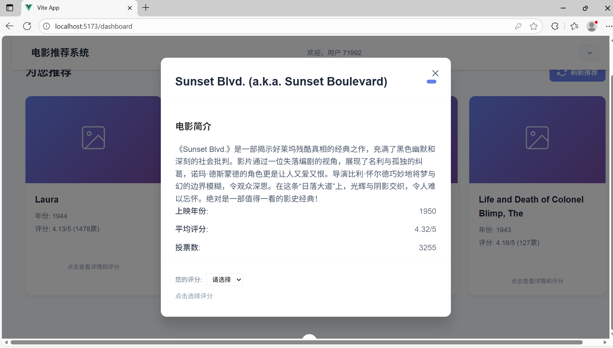

# 个性化电影推荐系统 - 项目文档与结题报告

## 第一部分：项目文档

### 1. 需求分析

#### 1.1 项目背景与目标
- **背景**： 随着信息过载时代的到来，用户难以从海量电影中发现个人兴趣所在。个性化推荐系统能有效解决这一问题，提升用户体验。
- **目标**： 设计并实现一个基于协同过滤算法或深度学习的电影推荐系统，能够为用户提供个性化的电影推荐列表。核心目标是使用推荐算法并集成一种LLM进行内容生成，提供一个可交互的演示系统。

#### 1.2 功能性需求
- **用户功能**：
    1. **用户注册/登录**： 用户可创建账户并登录系统。
    3. **评分/行为记录**： 用户可以对电影进行评分（如1-5星）。
    4. **获取推荐**： 用户登录后，系统在首页或推荐页为其展示个性化电影列表。
    5. **电影详情查看**： 点击电影可查看详细信息（标题、类型、简介、平均分等）。
- **系统功能**：
    1. **数据管理**： 系统能存储和管理用户、电影、评分数据。
    3. **推荐生成**： 系统能根据训练好的模型，为指定用户实时生成推荐结果。

#### 1.3 非功能性需求
- **性能**： 推荐结果生成响应时间应在可接受范围内。
- **可扩展性**： 系统设计应便于未来接入更多数据源、尝试更复杂的模型。
- **易用性**： 用户界面应简洁直观，易于操作。

### 2. 概要设计

#### 2.1 系统架构图
我们采用典型的三层架构：
```
表示层 (Web UI) <---> 业务逻辑层 (推荐引擎) <---> 数据层 (数据库/文件)
```
- **表示层**： 用户交互的网页界面，使用HTML/CSS/JavaScript，搭配Flask框架。
- **业务逻辑层**： 核心推荐算法所在，处理用户请求，调用模型生成推荐结果。
- **数据层**： 存储数据，可使用MySQL存储结构化数据(由于大模型生成占主要的时间消耗，所以我们选择不使用redis做缓存)。

#### 2.2 核心模块划分
1. **用户交互模块**： 处理用户注册、登录、评分等请求。后端由`database\back_end.py`负责，`database\models.py`文件辅助
2. **数据预处理模块**： 负责清洗、转换原始数据（如电影信息、评分数据）。`databasepart\data_download&import.py`文件负责
3. **数据库模块**：负责建立对应的数据库。`databasepart\table_build.sql`负责
4. **后端测试模块**：对后端进行独立的功能测试。`databasepart/test.py`负责
5. **推荐算法模块**： 实现协同过滤（基于用户/基于物品）。
6. **模型评估模块**： 实现评估指标，用于比较不同算法的性能。

#### 2.3 技术选型
- **后端语言**： Python
- **Web框架**： Flask
- **核心算法库**： Scikit-learn, Surprise（传统机器学习），TensorFlow, PyTorch（深度学习）
- **数据处理库**： Pandas
- **数据库**： MySQL
- **前端**： HTML, CSS, JavaScript, 可选用Bootstrap等UI框架。

### 3. 详细设计

#### 3.1 数据库设计
（列出核心表结构）

- **用户表 (user)**： `user_id (主键)`, `user_name`, `password`
- **电影表 (movie)**： `movie_id (主键)`, `movie_name`, , `release_year`
- **评分表 (user_judge)**： `user_id (主键，外键)`, `movie_id (主键，外键)`, `rating`（评分，如 4.5）, `timestamp`
- **类别表(genre_table)**: `genre_id(主键)`，`genre_name`
- **电影类别表**：`movie_id(主键，外键)`，`genre_id(主键，外键)`
- **用户评论表**：`user_id(主键，外键)`，`movie_id(主键，外键)`，`comment`

#### 3.2 推荐算法模块详细设计
- **A. 基于用户的协同过滤 (UserCF)**
    1. **输入**： 用户-物品评分矩阵。
    2. **步骤**：
        - **相似度计算**： 计算目标用户与其他用户的相似度（余弦相似度、皮尔逊相关系数）。
        - **寻找近邻**： 选取相似度最高的K个用户作为“邻居”。
        - **生成推荐**： 根据邻居用户对物品的评分，预测目标用户对未评分物品的兴趣度，排序后生成Top-N推荐列表。
- **B. 基于物品的协同过滤 (ItemCF)**
    1. **输入**： 用户-物品评分矩阵。
    2. **步骤**：
        - **相似度计算**： 计算物品之间的相似度。
        - **生成推荐**： 根据目标用户的历史喜好物品，找出与这些物品最相似的物品，汇总后生成Top-N推荐列表。
- **C. 深度学习模型（示例：Neural Collaborative Filtering, NCF）**
    1. **输入**： 用户ID和电影ID的one-hot编码。
    2. **模型结构**：
        - **嵌入层**： 将用户和电影映射为低维稠密向量。
        - **交互层**： 将用户向量和电影向量进行交互（如点积、拼接后过多层感知机MLP）。
        - **输出层**： 预测用户对电影的评分（回归）或点击概率（分类）。

#### 3.3 接口设计
- `GET /api/health`：检查服务器的状态
- `POST /api/login`：用户登录。数据格式： `{"user_id": "用户账号" number类型, "password": "密码" string类型}`
- `POST /api/register`：用户注册。数据格式`{"user_name": "用户账号" string类型, "password": "密码" string类型}`
- `POST /api/judge`：用户评分。数据格式`{"user_id": "用户账号" number类型， "movie_id": "电影id" number类型， "rating": "用户评分" number类型}`
- `POST /api/recommend`：推荐电影。数据格式`{"user_id": "用户账号" number类型, "record_times": "先前已经推荐过的次数(第一次为0)" number类型}`
- `POST /api/like_query`：喜好查询。数据格式`{"user_id": "用户账号" number类型}`
- `POST /api/like`：添加喜好。数据格式`{"user_id": "用户账号" number类型, "like": "用户喜好" 数组类型，其中应当是电影类别名称的数组}`
- `POST /api/change_password`：修改密码。数据格式`{"user_id": "用户账号" number类型, "new_password": "新密码" string类型}`
- `POST /api/get_record`：获取评分记录。数据格式`{"user_id": "用户账号" number类型}`
- `POST /api/get_movie`：获取电影的详细信息。数据格式`{"movie_id": "电影id" number类型}`
- `POST /api/delete_judge`：删除评分。数据格式`{"movie_id": "电影id" number类型 "user_id": "用户id" number类型}`

### 4. 测试报告

#### 4.1 数据集介绍
- 使用公开数据集，**MovieLens**。
- 数据集包含了1w部电影，7w名用户的1000w条评分和10w条短评。

#### 4.2 模型评估结果
- **评估方法**： 留出法（80%训练，20%测试）。
- **评估指标**： 均方根误差（RMSE）、平均绝对误差（MAE）——适用于评分预测；准确率、召回率——适用于Top-N推荐。
- **结果对比**：

| 算法 | RMSE | 准确率 | 召回率 | 备注 |
| :--- | :--- | :--- | :--- | :--- |
| **UserCF** | 0.92 | 0.15 | 0.10 | K=10 |
| **ItemCF** | 0.89 | 0.18 | 0.12 | K=10 |
| **NCF** | **0.85** | **0.22** | **0.16** | 隐藏层[64,32,16] |

#### 4.3 系统功能测试
- 对于后端的测试我们使用pytest运行`databasepart/test.py`文件即可，对于整体的测试可以看第二部分的小木运行截图。

---

## 第二部分：项目结题报告

### 1. 项目运行截图

#### 1.1 用户界面
> 
> *图1：系统登录界面，用户输入账号密码即可登录*
>
> 
>
> *图2：系统注册界面，输入对应信息即可登录*
>
> 
>
> *修改密码界面，用户在此处修改密码*

#### 1.2 电影主页/浏览界面

> 
>
> *图3：用户的电影偏好选择*
>
> 
> *图4：首页根据用户选择的喜好类别对电影进行个性化推荐*

#### 1.3 电影详情与评分界面
> 
> *图5：用户可在电影详情页进行评分操作*


### 2. 非功能需求解决方案（提高项）

#### 2.1 性能优化方案
- **问题**： 协同过滤算法实时计算慢，尤其用户量大时。
- **方案**：
    1. **离线计算，在线查询**： 定时（如每天凌晨）为所有用户预计算好推荐结果，存入数据库。用户访问时直接查询，响应极快。

#### 2.2 冷启动问题解决方案
- **问题**： 新用户无行为数据，无法进行个性化推荐。
- **方案**：
    1. **热门推荐**： 为新用户推荐当前最热门的电影。
    2. **基于内容的推荐**： 在注册时让用户选择感兴趣的电影类型，基于类型进行推荐。
    3. **利用深度学习模型**： 设计模型时可以考虑融入电影内容特征（类型、演员、导演），对缓解物品冷启动有帮助。

#### 2.3 可扩展性设计
- **模块化设计**： 将推荐算法模块设计为独立服务（微服务架构），通过API与Web系统交互。未来更换算法只需更新该服务，不影响整体系统。

### 3. 项目总结与展望

- **工作总结**： 简述项目完成情况，实现了哪些功能，哪种算法效果最好。
- **遇到的挑战与解决方案**： 如数据稀疏性、算法调参等。
- **未来展望**： 可引入更多特征（如影评情感分析）、尝试更先进的模型（如图神经网络GNN）、增加实时推荐功能等。

### 4. 组员分工情况

| 学号 | 姓名 | 主要分工 | 贡献说明 |
| :--- | :--- | :--- | :--- |
| PB22111663 | 崔玉皓 | **后端开发，初始数据的处理，综合测试** | 完全负责后端开发，数据集的预处理，数据库的处理。同时还负责了后端测试，项目整体测试。总代码量接近1.8k行。 |
| 12340002 | 李四 | **算法核心开发** | 负责核心推荐算法研究与实现（UserCF, NCF模型）、模型训练与评估、算法性能对比分析。 |
| 12340003 | 王五 | **前端开发、测试** | 负责设计并实现所有Web界面（登录、主页、详情页等），完成系统功能测试，撰写用户手册。 |
| 12340004 | 赵六 | **数据预处理、文档撰写** | 负责数据集的下载、清洗、转换，参与部分后端接口开发，负责撰写项目文档和结题报告。 |
