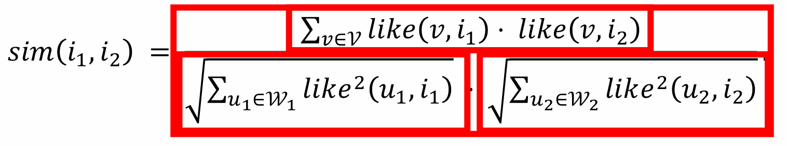
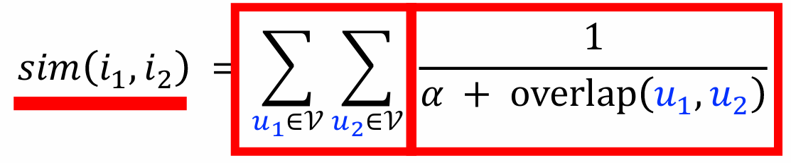

# 推荐系统笔记

from Wangshusen

## 1. Basics

**消费指标：**

点击率=点击次数/曝光次数
点赞率=点赞次数/点击次数
收藏率=收藏次数/点击坎数
转发率=转发次数/点击次数
阅读完成率=滑动到底次数/点击次数×f（笔记长度）

**北极星指标:**

用户规模：日活用户数(DAU)、月活用户数(MAU)。

消费：人均使用推荐的时长、人均阅读笔记的数量。

发布：发布渗透率、人均发布量。

**实验流程：**

离线实验 - 小流量A/B测试 - 全流量上线

**推荐系统的链路:**

召回 - 粗排 - 精排 - 重排

召回：用多条通道’取回几千篇笔记
粗排：用小规模神经网络，给几千篇笔记打分，选出分数最高的几百篇。
精排：用大规模神经网络，给几百篇笔记打分。
重排：做多样性抽样、规则打散、插入广告和运营笔记。

**A/B测试基础：**

分层实验：同层互斥，不同层正交

holdout：保留10%的用户，完全不受实验影响，可以考察整个部门对业务指标的贡献

实验推全：新建一个推全层，与其他层正交。

反转实验：在新的推全层上，保留一个小的反转桶使用旧策略。长期观测新旧策略的diff

## 2. Retrieval

**基于物品的协同过滤（ItemCF）**

原理：用户喜欢物品i1那么用户喜欢与物品i1相似的物品i2。

物品相似度：如果喜欢i1、i2的用户有很大的重叠，那么i1与i2相似

公式：余弦相似度

ItemCF流程（召回通道）：

离线维护两个索引：

- 用户→物品列表：用户最近交互过的n个物品。
- 物品→物品列表：相似度最高的k个物品。

线上做召回：

- 利用两个索引，每次取回nk个物品。
- 预估用户对每个物品的兴趣分数：
  - $∑_j like(user,item_j)×sim(item_j,item)$
- 返回分数最高的100个物品，作为召回结果。

**Swing模型**

重合度定义：用户u1喜欢的物品记作集合J1，用户u2喜欢的物品记作集合J2。定义两个用户的重合度：

$$
overlap(u_1,u_2)= | J_1∩ J_2 |
$$

用户u1和u2的重合度高，则他们可能来自一个小圈子，要降低他们的权重。

相似度定义：喜欢物品i1的用户记作集合W1，喜欢物品i2的用户记作集合W2，定义交集$V=W1∩W2$，则两个物品的相似度：

Swing 与 ItemCF 唯⼀的区别在于物品相似度。

**基于用户的协同过滤（UserCF）**

原理：如果用户user1跟用户user2相似，而且user2喜欢某物品，那么用户user1也很可能喜欢该物品。

用户相似度：如果用户u1和u2喜欢的物品有很大的重叠，那么u1和u2相似。

- 公式：$sim(u_1, u_2) = \frac{|J_1 \cap J_2|}{\sqrt{|J_1| \cdot |J_2|}}$

- 把每个用户表示为一个稀疏向量，向量每个元素对应一个物品，相似度sim就是两个向量夹角的余弦。

UserCF流程（召回通道）：

离线维护两个索引：

- 用户→物品列表：用户近期交互过的n个物品。

- 用户→用户列表：相似度最高的k个用户。

线上做召回：

- 利用两个索引，每次取回nk个物品。
- 预估用户user对每个物品item的兴趣分数：
  - $∑_j sim(user,user_j)×like(user_j,item)$  
- 返回分数最高的100个物品，作为召回结果。

**离散特征处理**

1. 建立字典：把特征映射成序号
2. 向量化：把序号映射成向量
   - One-hot编码：把序号映射成高维稀疏向量
   - Embedding：把序号映射成低维稠密向量。Embedding层参数数量=向量维度×类别数量

**矩阵补充**

原理：把物品ID、用户ID做embedding，映射成向量$a_u,b_i$。令两个向量的內积$〈a_u,b_i〉$作为用户u对物品i兴趣的预估。

让$〈a_u,b_i〉$拟合真实观测的兴趣分数，从而学习模型的embedding层参数：
$$
\min_{\color{blue}{A}, \color{red}{B}} \sum_{(u,i,y) \in \Omega} \left( y - \langle \color{blue}{\mathbf{a}_u}, \color{red}{\mathbf{b}_i}\color{black} \rangle \right)^2.
$$
模型缺点：

- 缺点1：仅用ID embedding，没利用物品、用户属性
- 缺点2：负样本的选取方式（曝光之后没有点击，交互）不对
- 缺点3：做训练的方法不好：內积$〈a_u,b_i〉$不如余弦相似度，用平方损失（回归），不如用交叉熵损失（分类）

线上召回：

- 把用户向量a作为query,查找使得$〈a_u,b_i〉$最大化的物品i。
- 暴力枚举速度太慢，实践中用近似最近邻查找。
- Milvus、Faiss、HnswLib等向量数据库支持近似最近邻查找。

*拓展：**近似最近邻（Approximate Nearest Neighbor, ANN）查找算法**

1. 基于哈希的方法（Hashing-based）

    通过哈希函数将相似的向量映射到相同的“桶”中，实现快速检索。

    - LSH（Locality-Sensitive Hashing，局部敏感哈希）  
      - 核心思想：设计哈希函数，使得距离近的点有更高概率被哈希到同一桶。  
      - 适用距离：欧氏距离（L2）、余弦相似度、Jaccard 距离等。  
      - 优点：理论保证、易于并行。  
      - 缺点：高维下需大量哈希表，内存开销大。  
      - 实现库：`NearPy`, `LSHKIT`

2. 基于树的方法（Tree-based）

      构建空间划分树结构，通过剪枝加速搜索。

    - KD-Tree（K-Dimensional Tree）  
      - 适用于低维（通常 < 20 维），高维性能退化严重（“维度灾难”）。
    - Ball Tree  
      - 用超球体划分空间，对某些距离度量（如余弦）比 KD-Tree 更鲁棒。
    - Annoy（Approximate Nearest Neighbors Oh Yeah）  
      - Spotify 开发，使用随机投影树（Random Projection Trees）。  
      - 特点：内存映射、支持多线程、适合静态数据集。  
      - 库：`annoy`（Python）

    > ⚠️ 树方法在高维（>50 维）通常不如图或量化方法高效。

3. 基于图的方法（Graph-based） ⭐（当前 SOTA）

    构建近邻图，通过贪心搜索在图上“游走”逼近最近邻。

    - HNSW（Hierarchical Navigable Small World）  
      - 核心：多层图结构（高层稀疏、底层稠密），实现“高速公路+本地搜索”。  
      - 优点：高召回率、低延迟、支持动态插入。  
      - 缺点：内存占用较高。  
      - 库：`hnswlib`, `FAISS`（支持 HNSW）

    - NSG（Navigating Spreading-out Graph）  
      - 优化图的出度和路径长度，提升搜索效率。  
      - 库：`NGT`（Yahoo Japan）

4. 基于量化的方法（Quantization-based）

    将高维向量压缩为紧凑编码，减少内存和计算开销。

    - PQ（Product Quantization，乘积量化）  
      - 将向量分段，每段独立聚类编码，用码本近似原始向量。  
      - FAISS 的核心组件之一。
    - OPQ（Optimized PQ）：PQ 的改进版，通过旋转优化分段。
    - IVF（Inverted File Index） + PQ  
      - 先用聚类（如 k-means）划分向量到“倒排列表”，再对每个列表内向量用 PQ 压缩。  
      - FAISS 默认推荐方案（如 `IVF1024,PQ16`）。

    > ✅ FAISS（Facebook AI Similarity Search） 是此类方法的集大成者，支持 GPU 加速。

5. 混合方法

    结合多种技术以平衡速度、精度和内存。

    - FAISS 的 HNSW + PQ：用 HNSW 加速 PQ 的粗筛过程。
    - ScaNN（Scalable Nearest Neighbors）（Google）  
      - 结合各向异性向量量化（Anisotropic Vector Quantization）和分区搜索。  
      - 在高精度场景表现优异。

**双塔模型**

用户塔：把用户ID，用户离散特征，连续特征向量化后拼接，输入神经网络，得到用户的表征向量

物品塔：把物品ID，物品离散特征，连续特征向量化后拼接，输入神经网络，得到物品的表征向量

令两个向量的余弦相似度作为用户对物品兴趣的评估

三种训练方式：

- Pointwise：每次用一个用户、一个物品（可正可负）；

  把召回看做二元分类任务。

  - 对于正样本，鼓励cos(a,b)接近+1
  - 对于负样本，鼓励cos(a,b)接近-1
  - 控制正负样本数量为1：2或者1：3

- Pairwise：每坎用一个用户、一个正样本、一个负样本；

  基本想法：鼓励cos(a,b+)大于cos(a,b-)

  - Triplet hinge loss：$L(a,b^+,b^-)=max{0 ,cos(a,b^-)+m-cos(a,b^+)}$
  - Triplet logistic loss：$L(a,b^+,b^-)=log(1+exp[\sigma\times (cos(a,b)-cos(a,b))]).$

- Listwise：每次用一个用户、一个正样本、多个负样本

  鼓励$cos(a,b^+)$大于$cos(a,b^-_1), …, cos(a,b^-_n) $

  - Loss：$CrossEntropyLoss = −log(Softmax(cos(a,b^+)))$

正负样本选择

- 正样本：曝光而且有点击的用户-物品二元组

  问题：少部分物品占据大部分点击，导致正样本大多是热门物品

  解决方紊：过采样冷门物品，或降采样热门物品

  - 过采样(up-sampling)：一个样本出现多次
  - 降采样(down-sampling)：一些样本被抛弃

- 负样本：考虑3类，分别为没有被召回，被召回但没有曝光，被曝光但没有点击

