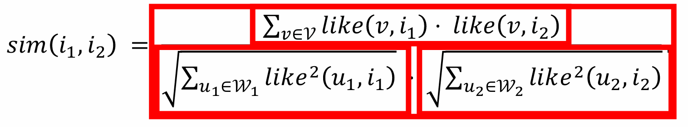
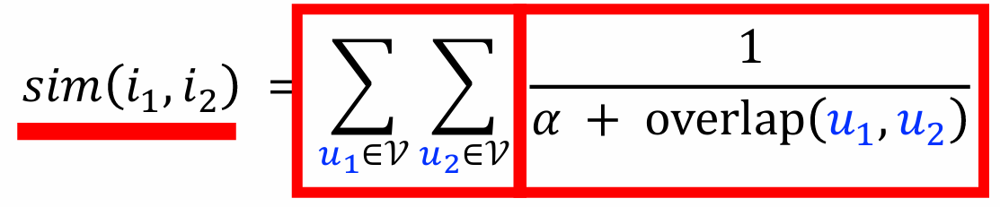

# 推荐系统笔记

from Wangshusen

## 1. Basics

### **消费指标：**

点击率=点击次数/曝光次数
点赞率=点赞次数/点击次数
收藏率=收藏次数/点击坎数
转发率=转发次数/点击次数
阅读完成率=滑动到底次数/点击次数×f（笔记长度）

### **北极星指标:**

用户规模：日活用户数(DAU)、月活用户数(MAU)。

消费：人均使用推荐的时长、人均阅读笔记的数量。

发布：发布渗透率、人均发布量。

### **实验流程：**

离线实验 - 小流量A/B测试 - 全流量上线

### **推荐系统的链路:**

召回 - 粗排 - 精排 - 重排

召回：用多条通道’取回几千篇笔记
粗排：用小规模神经网络，给几千篇笔记打分，选出分数最高的几百篇。
精排：用大规模神经网络，给几百篇笔记打分。
重排：做多样性抽样、规则打散、插入广告和运营笔记。

### **A/B测试基础：**

分层实验：同层互斥，不同层正交

holdout：保留10%的用户，完全不受实验影响，可以考察整个部门对业务指标的贡献

实验推全：新建一个推全层，与其他层正交。

反转实验：在新的推全层上，保留一个小的反转桶使用旧策略。长期观测新旧策略的diff

## 2. Retrieval

### **基于物品的协同过滤（ItemCF）**

原理：用户喜欢物品i1那么用户喜欢与物品i1相似的物品i2。

物品相似度：如果喜欢i1、i2的用户有很大的重叠，那么i1与i2相似

公式：余弦相似度

ItemCF流程（召回通道）：

离线维护两个索引：

- 用户→物品列表：用户最近交互过的n个物品。
- 物品→物品列表：相似度最高的k个物品。

线上做召回：

- 利用两个索引，每次取回nk个物品。
- 预估用户对每个物品的兴趣分数：
  - $∑_j like(user,item_j)×sim(item_j,item)$
- 返回分数最高的100个物品，作为召回结果。

### **Swing模型**

重合度定义：用户u1喜欢的物品记作集合J1，用户u2喜欢的物品记作集合J2。定义两个用户的重合度：

$$
overlap(u_1,u_2)= | J_1∩ J_2 |
$$

用户u1和u2的重合度高，则他们可能来自一个小圈子，要降低他们的权重。

相似度定义：喜欢物品i1的用户记作集合W1，喜欢物品i2的用户记作集合W2，定义交集$V=W1∩W2$，则两个物品的相似度：

Swing 与 ItemCF 唯⼀的区别在于物品相似度。

### **基于用户的协同过滤（UserCF）**

原理：如果用户user1跟用户user2相似，而且user2喜欢某物品，那么用户user1也很可能喜欢该物品。

用户相似度：如果用户u1和u2喜欢的物品有很大的重叠，那么u1和u2相似。

- 公式：$sim(u_1, u_2) = \frac{|J_1 \cap J_2|}{\sqrt{|J_1| \cdot |J_2|}}$

- 把每个用户表示为一个稀疏向量，向量每个元素对应一个物品，相似度sim就是两个向量夹角的余弦。

UserCF流程（召回通道）：

离线维护两个索引：

- 用户→物品列表：用户近期交互过的n个物品。

- 用户→用户列表：相似度最高的k个用户。

线上做召回：

- 利用两个索引，每次取回nk个物品。
- 预估用户user对每个物品item的兴趣分数：
  - $∑_j sim(user,user_j)×like(user_j,item)$  
- 返回分数最高的100个物品，作为召回结果。

### **离散特征处理**

1. 建立字典：把特征映射成序号
2. 向量化：把序号映射成向量
   - One-hot编码：把序号映射成高维稀疏向量
   - Embedding：把序号映射成低维稠密向量。Embedding层参数数量=向量维度×类别数量

### **矩阵补充**

原理：把物品ID、用户ID做embedding，映射成向量$a_u,b_i$。令两个向量的內积$〈a_u,b_i〉$作为用户u对物品i兴趣的预估。

让$〈a_u,b_i〉$拟合真实观测的兴趣分数，从而学习模型的embedding层参数：
$$
\min_{\color{blue}{A}, \color{red}{B}} \sum_{(u,i,y) \in \Omega} \left( y - \langle \color{blue}{\mathbf{a}_u}, \color{red}{\mathbf{b}_i}\color{black} \rangle \right)^2.
$$
模型缺点：

- 缺点1：仅用ID embedding，没利用物品、用户属性
- 缺点2：负样本的选取方式（曝光之后没有点击，交互）不对
- 缺点3：做训练的方法不好：內积$〈a_u,b_i〉$不如余弦相似度，用平方损失（回归），不如用交叉熵损失（分类）

线上召回：

- 把用户向量a作为query,查找使得$〈a_u,b_i〉$最大化的物品i。

- 暴力枚举速度太慢，实践中用近似最近邻查找。

- Milvus、Faiss、HnswLib等向量数据库支持近似最近邻查找。

*拓展：**近似最近邻（Approximate Nearest Neighbor, ANN）查找算法**

1. 基于哈希的方法（Hashing-based）

    通过哈希函数将相似的向量映射到相同的“桶”中，实现快速检索。

    - LSH（Locality-Sensitive Hashing，局部敏感哈希）  
      - 核心思想：设计哈希函数，使得距离近的点有更高概率被哈希到同一桶。  
      - 适用距离：欧氏距离（L2）、余弦相似度、Jaccard 距离等。  
      - 优点：理论保证、易于并行。  
      - 缺点：高维下需大量哈希表，内存开销大。  
      - 实现库：`NearPy`, `LSHKIT`

2. 基于树的方法（Tree-based）

      构建空间划分树结构，通过剪枝加速搜索。

    - KD-Tree（K-Dimensional Tree）  
      - 适用于低维（通常 < 20 维），高维性能退化严重（“维度灾难”）。
    - Ball Tree  
      - 用超球体划分空间，对某些距离度量（如余弦）比 KD-Tree 更鲁棒。
    - Annoy（Approximate Nearest Neighbors Oh Yeah）  
      - Spotify 开发，使用随机投影树（Random Projection Trees）。  
      - 特点：内存映射、支持多线程、适合静态数据集。  
      - 库：`annoy`（Python）

    > ⚠️ 树方法在高维（>50 维）通常不如图或量化方法高效。

3. 基于图的方法（Graph-based） ⭐（当前 SOTA）

    构建近邻图，通过贪心搜索在图上“游走”逼近最近邻。

    - HNSW（Hierarchical Navigable Small World）  
      - 核心：多层图结构（高层稀疏、底层稠密），实现“高速公路+本地搜索”。  
      - 优点：高召回率、低延迟、支持动态插入。  
      - 缺点：内存占用较高。  
      - 库：`hnswlib`, `FAISS`（支持 HNSW）

    - NSG（Navigating Spreading-out Graph）  
      - 优化图的出度和路径长度，提升搜索效率。  
      - 库：`NGT`（Yahoo Japan）

4. 基于量化的方法（Quantization-based）

    将高维向量压缩为紧凑编码，减少内存和计算开销。

    - PQ（Product Quantization，乘积量化）  
      - 将向量分段，每段独立聚类编码，用码本近似原始向量。  
      - FAISS 的核心组件之一。
    - OPQ（Optimized PQ）：PQ 的改进版，通过旋转优化分段。
    - IVF（Inverted File Index） + PQ  
      - 先用聚类（如 k-means）划分向量到“倒排列表”，再对每个列表内向量用 PQ 压缩。  
      - FAISS 默认推荐方案（如 `IVF1024,PQ16`）。

    > ✅ FAISS（Facebook AI Similarity Search） 是此类方法的集大成者，支持 GPU 加速。

5. 混合方法

    结合多种技术以平衡速度、精度和内存。

    - FAISS 的 HNSW + PQ：用 HNSW 加速 PQ 的粗筛过程。
    - ScaNN（Scalable Nearest Neighbors）（Google）  
      - 结合各向异性向量量化（Anisotropic Vector Quantization）和分区搜索。  
      - 在高精度场景表现优异。

### **双塔模型**

用户塔：把用户ID，用户离散特征，连续特征向量化后拼接，输入神经网络，得到用户的表征向量

物品塔：把物品ID，物品离散特征，连续特征向量化后拼接，输入神经网络，得到物品的表征向量

令两个向量的余弦相似度作为用户对物品兴趣的评估

三种训练方式：

- Pointwise：每次用一个用户、一个物品（可正可负）；

  把召回看做二元分类任务。

  - 对于正样本，鼓励cos(a,b)接近+1
  - 对于负样本，鼓励cos(a,b)接近-1
  - 控制正负样本数量为1：2或者1：3

- Pairwise：每坎用一个用户、一个正样本、一个负样本；

  基本想法：鼓励cos(a,b+)大于cos(a,b-)

  - Triplet hinge loss：$L(a,b^+,b^-)=max{0 ,cos(a,b^-)+m-cos(a,b^+)}$
  - Triplet logistic loss：$L(a,b^+,b^-)=log(1+exp[\sigma\times (cos(a,b)-cos(a,b))]).$

- Listwise：每次用一个用户、一个正样本、多个负样本

  鼓励$cos(a,b^+)$大于$cos(a,b^-_1), …, cos(a,b^-_n) $

  - Loss：$CrossEntropyLoss = −log(Softmax(cos(a,b^+)))$

正负样本选择

- 正样本：曝光而且有点击的用户-物品二元组

  问题：少部分物品占据大部分点击，导致正样本大多是热门物品

  解决方紊：过采样冷门物品，或降采样热门物品

  - 过采样(up-sampling)：一个样本出现多次
  - 降采样(down-sampling)：一些样本被抛弃

- 负样本：考虑3类，分别为没有被召回，被召回但没有曝光，被曝光但没有点击

  简单负样本：

  - 未被召回的物品 ≈ 全体物品 故从全体物品中抽样作为负样本

    均匀抽样问题：负样本大多是冷门物品，对冷门物品不公平

    故采用非均匀抽样：抽样概率 ∝ $(点击次数)^{0.75}$

  - 一个batch内有n个样本，对于每个用户，有（n-1）个负样本，总共$n*(n-1)$个负样本
  
    问题：物品出现在batch内的概率（也即成为负样本的概率） ∝点击次数，热门物品成为负样本的概率过大
  
    解决方法：训练时将用户对物品兴趣的评估函数调整为$cos(a, b_i)-log{p_i}$，其中$p_i$为物品𝑖被抽样到的概率
  
  困难负样本：被粗排淘汰的物品（比较困难）；精排分数靠后的物品（非常困难）
  
  有曝光没点击的样本：不能作为召回的负样本
  
  训练数据：混合简单负样本与困难负样本

召回流程：

- 做完训练，把物品向量存储到向量数据库，供线上最近邻查找。

- 线上召回时，给定用户ID、用户画像，调用用户塔 现算用户向量𝐚。

- 把𝐚作为query，查询向量数据库，找到余弦相似度最高的k个物品向量，返回k个物品ID。

  原因：线上算物品向量代价过大；用户兴趣动态变化，而物品特征相对稳定

模型更新：

- 全量更新：今天凌晨，用昨天的数据训练整个神经网络，做1epoch的随机梯度下降。
- 增量更新：用实时数据训练神经网络，只更新ID Embedding，锁住全连接层。
- 实际的系统： 全量更新&增量更新相结合。

双塔模型问题：推荐系统的头部效应严重，模型学不好长尾物品的表征

解决方法：自监督学习

- 对物品做随机特征变换（Random Mask, Dropout, 互补特征, Mask一组关联特征等），得到$b_i^{\prime\prime}$

- 目标：特征向量 $b_i^{\prime}$和 $b_i^{\prime\prime}$ 相似度高（相同物品）和 $b_j^{\prime\prime}$相似度低（不同物品）

- 方法：CrossEntropyLoss
  $$
  \text{CrossEntropyLoss}(\mathbf{y}_i, \mathbf{s}_i) = -\log s_{i,i} = -\log\left( \frac{\exp(\cos(\mathbf{b}'_i, \mathbf{b}''_i))}{\sum_{j=1}^{m} \exp(\cos(\mathbf{b}'_i, \mathbf{b}''_j))} \right)
  $$

- 模型训练方式：

  -  对点击做随机抽样，得到𝑛对用户-物品⼆元组，作为⼀个batch

  - 从全体物品中均匀抽样，得到𝑚个物品，作为⼀个 batch

  - 损失为双塔模型的损失与自监督学习的损失的加权和；训练时做梯度下降，使得损失减小
    $$
    Loss = \frac{1}{n} \sum_{i=1}^{n} L_{\text{main}}[i] \; + \; \alpha \cdot \frac{1}{m} \sum_{j=1}^{m} L_{\text{self}}[j].
    $$

- 效果：低曝光物品、新物品的推荐变得更准

### Deep Retrieval

暂略

### 其他召回通道

地理位置召回： GeoHash 召回、同城召回。（无个性化）

作者召回：关注的作者、有交互的作者、相似的作者

缓存召回：复用前𝑛次推荐精排的结果，将精排但未曝光的缓存（需要退场机制）

### 曝光过滤 & Bloom Filter

曝光过滤：如果用户看过某个物品，则不再把该物品曝光给该用户

问题：⼀位用户看过𝑛个物品，本次召回𝑟个物品，如果暴力对比，需要𝑂(𝑛𝑟)的时间。

解决方法：Bloom Filter

- 将每个用户的曝光物品的集合表征为⼀个m维二进制向量，需要𝑚 bit 的存储 

- 有 𝑘 个哈希函数，每个哈希函数把物品ID映射成介于0和𝑚−1之间的整数

- 若这些位置上整数全为1则判定为已曝光，否则判定为为曝光并将这些位置置1。

- 特点：可能误伤， 错误判断未曝光物品为已曝光，将其过滤掉

- 曝光物品集合大小为𝑛，⼆进制向量维度为𝑚，使用𝑘个哈希函数，则Bloom filter 误伤的概率为：
  $$
  \color{red}{\delta} \color{black}\approx \left(1 - \exp\left(-\frac{\color{blue}{k}\color{blue}{n}}{\color{blue}{m}}\right)\right)^{\color{blue}{k}}
  $$

-  设定可容忍的误伤概率为𝛿，那么最优参数为：
  $$
  \color{blue}{k}\color{black} = 1.44 \cdot \ln\left(\frac{1}{\color{red}{\delta}}\right), \quad \color{blue}{m}\color{black} = 2\color{blue}{n}\color{black} \cdot \ln\left(\frac{1}{\color{red}{\delta}}\right).
  $$

- 缺点：只支持添加物品，不支持删除物品。从集合中移除物品，无法消除它对向量的影响。

## 3. Rank

