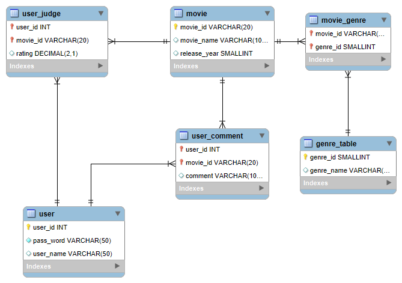

# 数据库部分文档

## 使用到的数据库

1. MySQL
2. redis

## MySQL使用到的表

注意，以上的表灯泡对应的就是主键，如果变了红色，代表这个属性是外键。

以下对各个表进行介绍

### movie

- movie_id ,表的主码
- movie_name 电影的名字，不作为主码，防止重名
- release_year 上映年份

### user

- user_id 登陆账号
- password 密码
- user_name 用户名，这部分可以为空

### user_judge

- user_id 外键，参照的user表的user_id
- movie_id 外键，参照movie表的movie_id
- rating 评分，0.5-5且小数部分只能是0或者5。

### genre_table

- genre_id 类别id
- genre_name 类别的名称

### movie_genre

- movie_id 外键，参照movie表的movie_id
- genre_id 外键，参照的genre_table的genre_id

### user_comment

- user_id 外键，参照的user表的user_id
- movie_id 外键，参照movie表的movie_id
- comment 用户对于电影非常简短的一个评价

