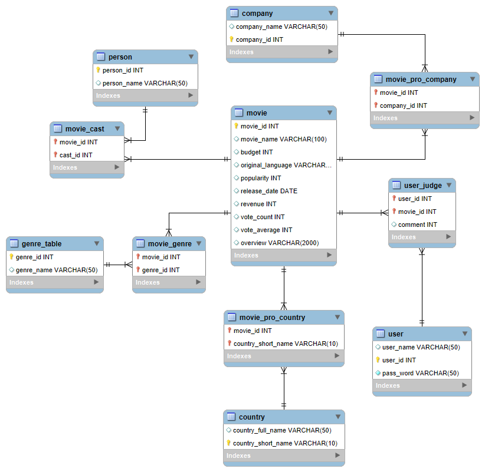

# 数据库部分文档

## 使用到的数据库

1. MySQL
2. redis

## MySQL使用到的表

注意，以上的表灯泡对应的就是主键，如果变了红色，代表这个属性是外键。

以下对各个表进行介绍

### movie

- movie_id ,表的主码
- movie_name 电影的名字，不作为主码，防止重名
- budget 电影的成本
- original_language 电影的原版语言
- popularity 电影的流行程度。
- release_date 上映日期
- revenue 票房
- vote_count 给这一部电影打分的人
- vote_average 打分的平均分
- overview 电影简介

### user

- user_name 用户名(可重名)
- user_id 登陆账号
- pass_word 密码

### user_judge

- user_id 外键，参照的user表的user_id
- movie_id 外键，参照movie表的movie_id
- commont 评分，1-10且只能是整数

### country

- country_name 国家名称
- country_id 国家的id

### movie_pro_country

- movie_id 外键，参照movie表的movie_id
- country_id 外键，参照的country表的country_id

### person

- person_id 人员id
- person_name 人员的姓名

### movie_cast

- movie_id 外键，参照的movie表的movie_id
- cast_id 外键，参照的person表的person_id

### genre_table

- genre_id 类别id
- genre_name 类别的名称

### movie_genre

- movie_id 外键，参照movie表的movie_id
- genre_id 外键，参照的genre_table的genre_id

### company

- company_name 出品公司的名字
- company_id 出品公司的id

### movie_pro_company

- movie_id，外键，参照movie表的movie_id
- company_id，外键，参照company表的company_id

